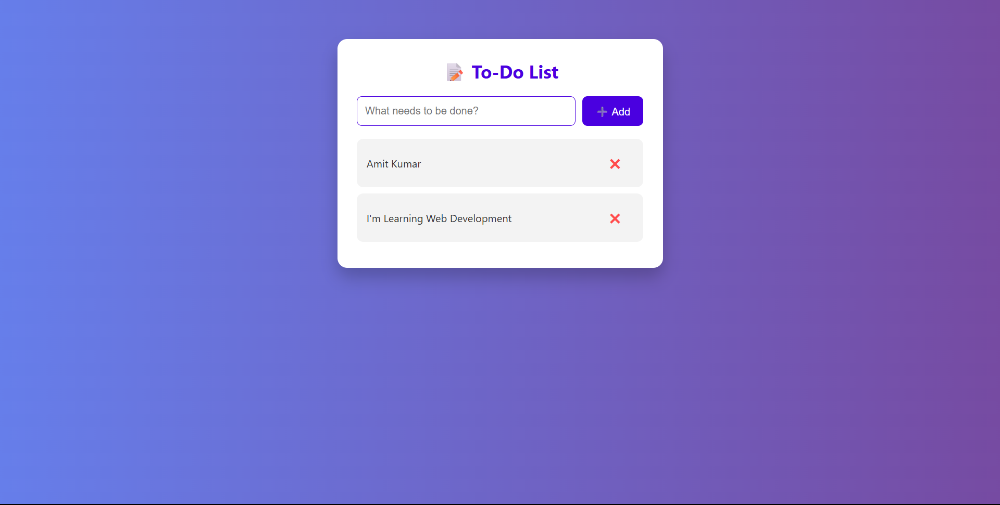

# 📝 To-Do List Web App (Vanilla JavaScript)

A clean and modern To-Do List web application built using **HTML**, **CSS**, and **Vanilla JavaScript**. This front-end-only project allows users to add, complete, and remove tasks with a responsive and interactive user interface.

---

## 🔍 Features

- ✅ Add new tasks with a single click or press `Enter`
- ✅ Mark tasks as complete/incomplete with a toggle
- ✅ Remove tasks individually
- ✅ Live DOM updates without page reload
- ✅ Smooth transitions and user-friendly design
- ✅ Responsive layout for mobile and desktop

---

## 💡 Project Objective

> Create a dynamic and attractive To-Do List web app using only front-end technologies. The goal is to demonstrate DOM manipulation, event handling, and modern UI/UX techniques without using external libraries or frameworks.

---

## 📸 Screenshots

---

## 📁 Project Structure

